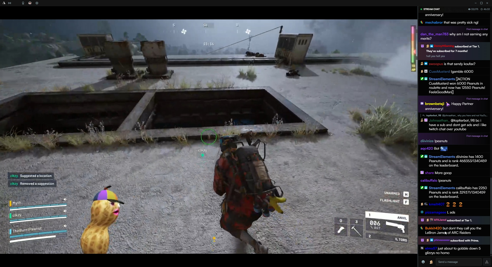
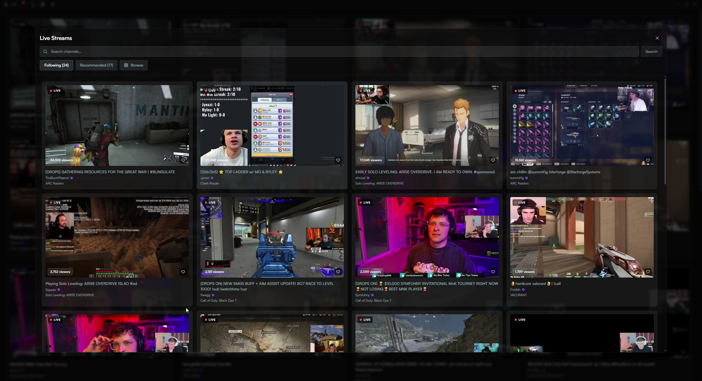
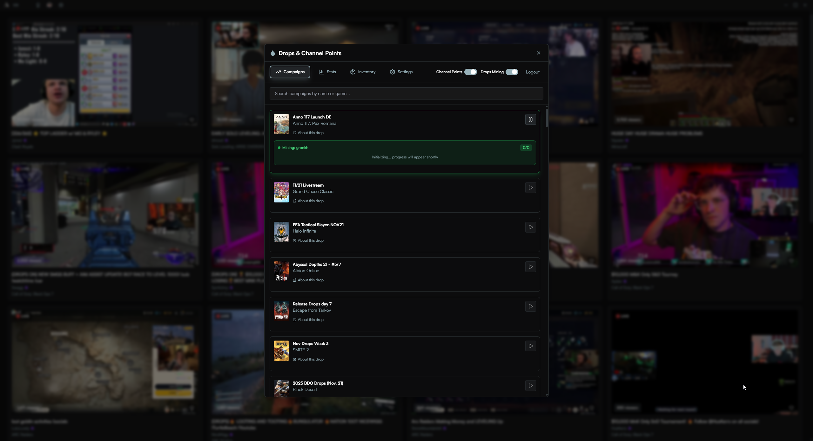
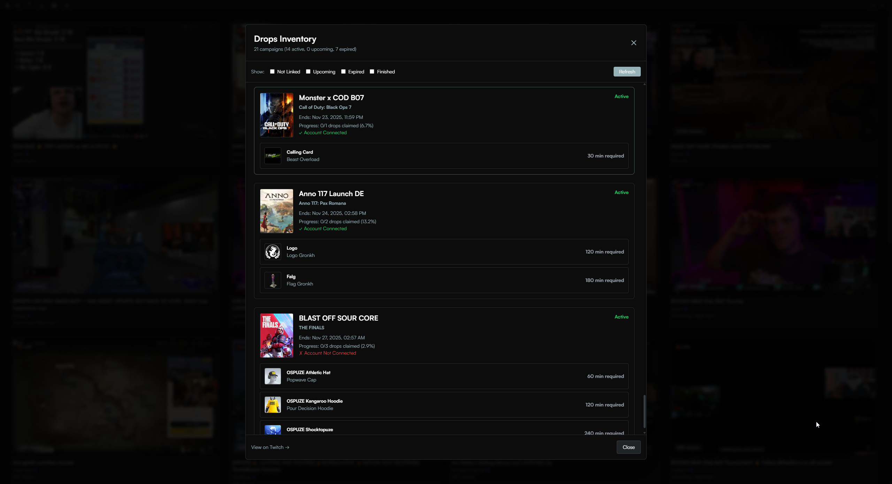
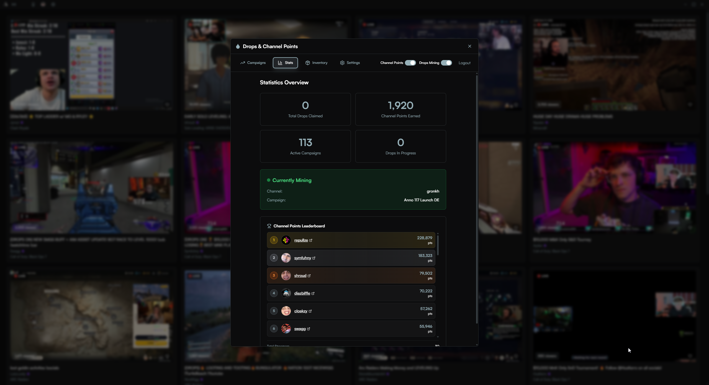
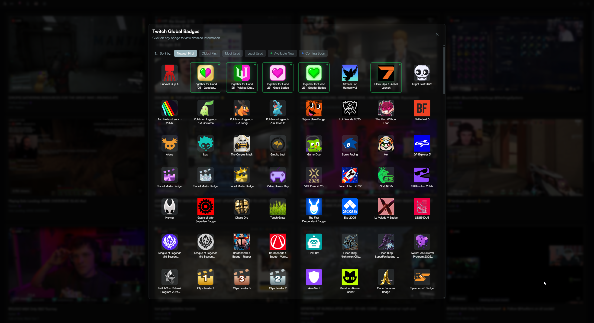
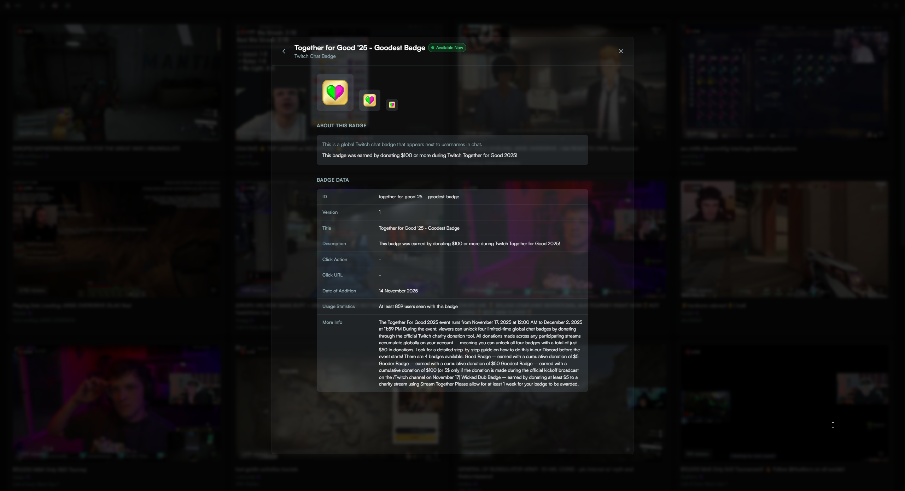

  

  <h1>StreamNook: The Lightweight Twitch Desktop App
</h1>

  

    

      
      
      
    

    

      
      
      
    

    

      
      
    

  

  

---

## 🎯 The Problem

Let's be honest: you're grinding through your 47th hour of that indie roguelike, talking to yourself about optimal build paths, when you realize—*I need human voices*. But opening Twitch in a browser? That's like inviting a resource-hungry elephant to sit on your CPU. Your fans spin up, your frame rate tanks, and suddenly you're choosing between watching streams and actually playing games.

**StreamNook** is the answer to this very specific but deeply relatable problem.

Built from the ground up with Rust and React, StreamNook delivers a buttery-smooth Twitch experience that sips resources instead of chugging them. It's the cozy corner of the internet where you can watch streams, chat with communities, and track your favorite streamers—all without turning your PC into a space heater.

---

## Screenshots

### Main Interface

### Live Following

### Drops & Inventory Management

  
  

    

### Badges

    
    

---

## Key Features

### Native Video Playback
- Built-in player powered by Plyr, HLS.js, and Streamlink
- Adaptive quality selection (because your internet isn't always cooperating)
- Picture-in-picture support for true multitasking
- Low-latency streaming that keeps you in sync with chat
- Theater mode with automatic 16:9 aspect ratio

### First-Class Chat Experience
- Full Twitch chat integration with native IRC support
- 7TV, BetterTTV, and FrankerFaceZ emote support (all the emotes, all the time)
- **Animated 7TV emotes** - Full support for animated emotes and zero-width overlays
- Badge rendering for subs, mods, and VIPs
- Third-party badge integration (show off those achievements)
- Smooth scrolling and message rendering that doesn't stutter
- **Apple-style emoji rendering** - Consistent emoji display across all platforms
- Native emoji picker for easy emoji selection
- Bits cheers display with animated icons and tier colors
- **Chat timestamps** - Optional message timestamps with seconds support
- **Moderator tools** - Delete messages, timeouts, and bans reflected in chat

### Home Screen & Discovery
- Browse followed and recommended streams
- Explore Twitch categories and games
- Search for channels
- Picture-in-picture mode while browsing

### Automated Farming & Rewards
- **Auto Channel Points Mining** - Automatically collect channel points from your favorite streamers
- **Auto Drops Farming** - Never miss a Twitch Drop again with automated campaign tracking
- **In-App Drops Login** - Secure in-app browser window for drops authentication
- **Quick Mining Toggle** - Start/stop mining drops directly from the chat window
- **Channel Points Leaderboard** - Track your channel points across all streamers you watch
- **Twitch Inventory Viewer** - View and manage all your earned drops and rewards in one place
- **Manual Channel Selection** - Choose specific channels for drops mining
- **Badge Quick Actions** - View linked drops campaigns directly from badge details
- Set it and forget it - StreamNook handles the grinding while you sleep

### Channel Automation
- **Follow/Unfollow from App** - Follow and unfollow channels directly from StreamNook
- **Raid Auto-Follow** - Automatically follow raids to keep up with the action
- Uses secure in-app browser automation - no manual intervention needed

### Live Notifications
- Desktop notifications when your favorite streamers go live
- Customizable notification settings with sound options
- Stream preview thumbnails
- Quick-launch to any live channel

### Dynamic Island Notification Center
- macOS-inspired notification center built into the app
- Real-time updates for drops progress, channel points earned, and live streams
- Update notifications when new versions are available
- Compact, non-intrusive design that stays out of your way
- Customizable notification types

### Whisper Messaging System
- Full whisper functionality with message sending and receiving
- Complete whisper history retrieval using Twitch's GraphQL API
- Real-time whisper notifications via EventSub WebSocket
- Dedicated whisper chat windows for each conversation
- Import tool for exporting and viewing your whisper history

### Rich Integrations
- Discord Rich Presence (flex what you're watching)
- Profile cards with detailed streamer stats
- Subscribe overlay for easy sub management
- Badge collection and display system with detailed badge info
- 7TV cosmetics support

### Theming & Customization
- Multiple built-in themes (Night Owl, Synthwave '84, Material Theme, and more)
- Dynamic theme switching
- Customizable interface settings

### Power User Features
- Universal caching system for blazing-fast load times
- Granular settings for every aspect of the app
- Custom quality presets
- Advanced Streamlink settings (low-latency, HLS live edge, proxy)
- **Custom Streamlink path** - Use your own Streamlink installation
- **Jump to live edge** - Skip to live on stream load
- Auto-switch to another stream when current goes offline
- Automatic updates with optional auto-install
- **Whisper history import** - Import your entire Twitch whisper history

### Lightweight Architecture
- Built with Rust for maximum performance
- React frontend for smooth, responsive UI
- Native desktop integration via Tauri
- Minimal memory footprint (~500MB vs. browser's 1.5GB+)
- Bundled Streamlink - no external dependencies required
- No Electron bloat in sight

---

## Tech Stack

StreamNook is built on a modern, performance-first stack:

### Frontend
- **React 18** - UI framework
- **TypeScript** - Type safety and developer experience
- **Vite** - Lightning-fast build tooling
- **Tailwind CSS** - Utility-first styling
- **Plyr + HLS.js** - Professional-grade video playback
- **Zustand** - Lightweight state management

### Backend
- **Rust** - Systems programming language for performance
- **Tauri** - Native desktop framework (Electron's cooler cousin)
- **Tokio** - Async runtime for concurrent operations
- **Reqwest** - HTTP client for API calls
- **Serde** - Serialization/deserialization

### Services & APIs
- **Twitch API** - Stream data, user info, and Drops
- **Twitch IRC** - Real-time chat integration
- **Twitch EventSub** - Live notifications and whispers via WebSocket
- **Streamlink** - Stream URL resolution and quality selection (bundled)
- **7TV API** - Extended emote support
- **Discord RPC** - Rich presence integration

---

## Installation

### Quick Start

1. Download the latest release from the [Releases page](https://github.com/winters27/StreamNook/releases/latest)
2. Extract and run the application
3. Follow the setup wizard to sign in with your Twitch account
4. Start watching streams

That's it. StreamNook comes with everything bundled—no external dependencies or configuration required.

---

## Roadmap

We're constantly improving StreamNook. Here's what's on the horizon:

### In Progress
- Multi-stream viewing (watch multiple streams simultaneously)
- VOD playback with chat replay

### Planned
- Clip creation and management
- Predictions and polls integration
- Stream analytics and statistics
- Moderation tools

### Recently Completed
- ✅ **Animated 7TV emotes** with zero-width overlay support
- ✅ **Follow/Unfollow automation** directly from the app
- ✅ **Raid auto-follow** for seamless raid tracking
- ✅ **Whisper history import** - import your entire DM history
- ✅ **In-app drops login** with secure browser window
- ✅ **Chat timestamps** with optional seconds display
- ✅ **Moderator tools** - bans/timeouts reflected in chat
- ✅ **Apple-style emoji rendering** across all platforms
- ✅ **Custom Streamlink path** support
- ✅ **Quick mining toggle** from chat window
- ✅ Home screen with stream browsing and discovery
- ✅ Picture-in-picture mode
- ✅ Sidebar navigation
- ✅ Whisper functionality with history
- ✅ Theming system with multiple themes
- ✅ Bundled Streamlink distribution (no manual install)
- ✅ Auto-update with optional auto-install
- ✅ Desktop notifications with sounds
- ✅ Dynamic Island notifications
- ✅ First-time setup wizard
- ✅ Drops automation and tracking
- ✅ Channel points automation
- ✅ Inventory management system
- ✅ Channel points leaderboard
- ✅ Auto-switch when stream goes offline

---

## Contributing

StreamNook is open source and we welcome contributions! Whether it's bug reports, feature requests, documentation improvements, or code contributions—we'd love to have you involved.

---

## Credits

StreamNook stands on the shoulders of giants:

- **[Streamlink](https://github.com/streamlink/streamlink)** - The backbone of our streaming infrastructure
- **[Tauri](https://tauri.app/)** - Making native desktop apps not suck
- **[Plyr](https://plyr.io/)** - Beautiful video player
- **[HLS.js](https://github.com/video-dev/hls.js)** - HLS streaming support
- **[7TV](https://7tv.app/)** - Extended emote support
- **[Twitch](https://dev.twitch.tv/)** - For having a (mostly) decent API

Special thanks to the open-source community for making projects like this possible.

---

## License

This project is licensed under the MIT License - see the [LICENSE](LICENSE) file for details.

---

  

    
  

  

    
    
    
  

  

    

      StreamNook is not affiliated with Twitch Interactive, Inc.
    

  

<!-- Build: 2025.12.08 -->
