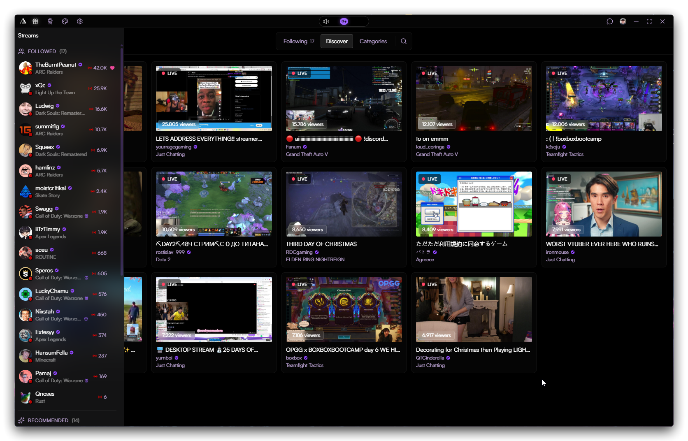
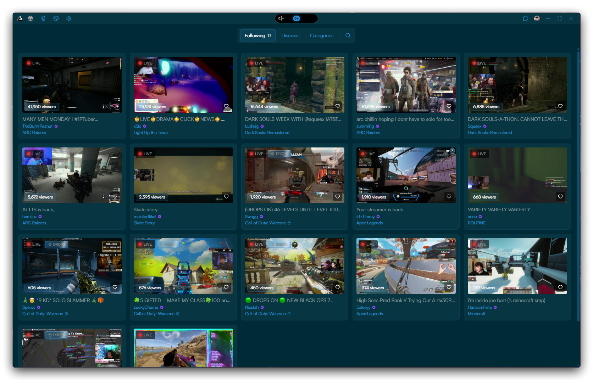
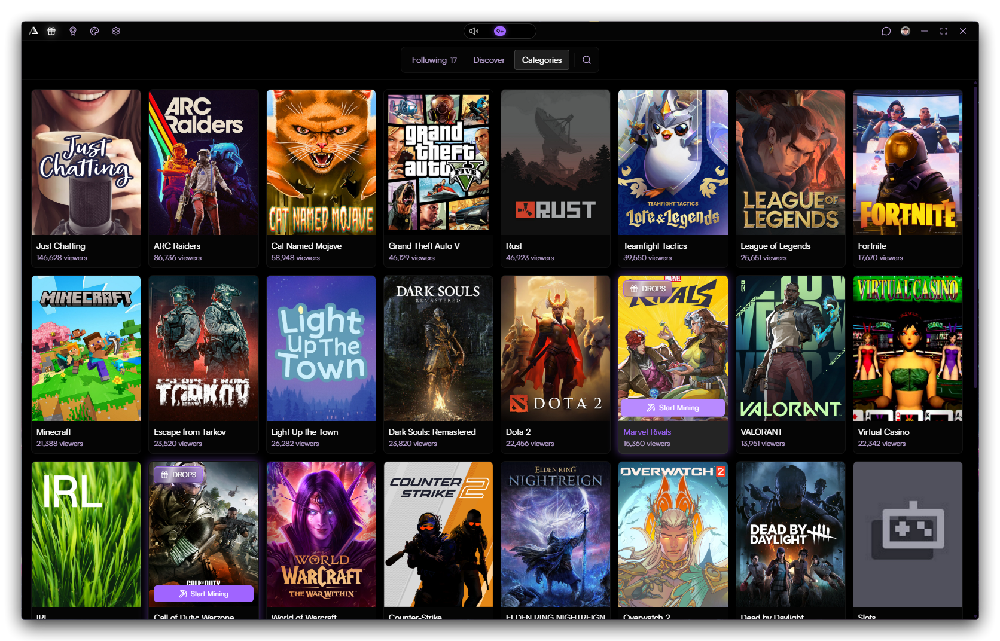
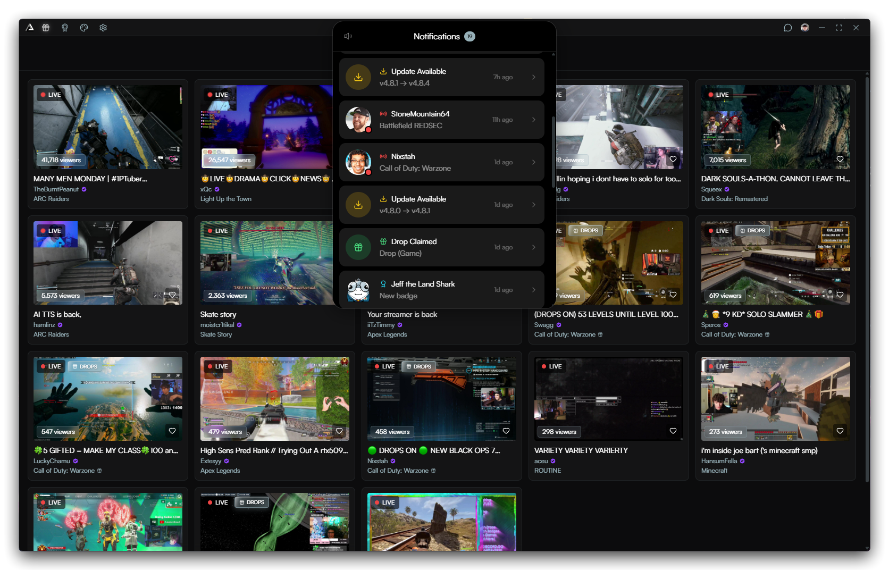
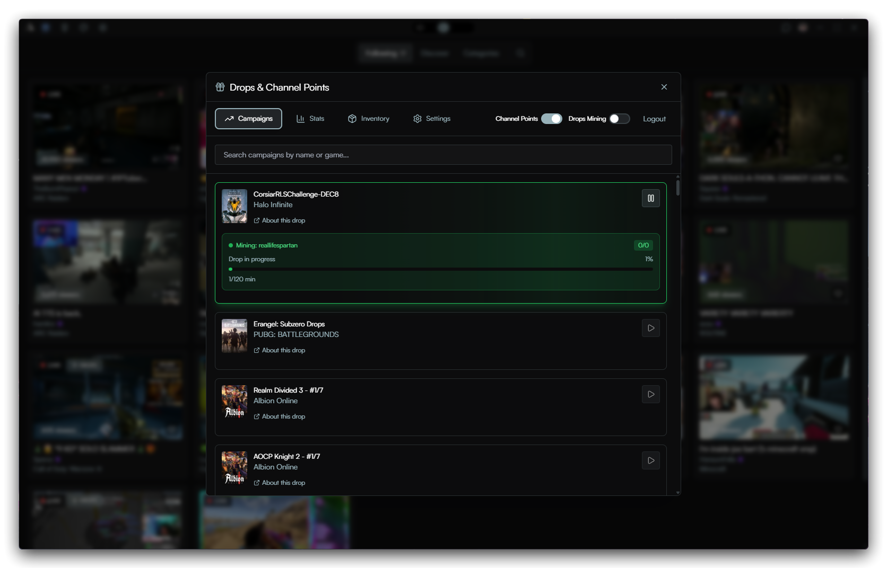
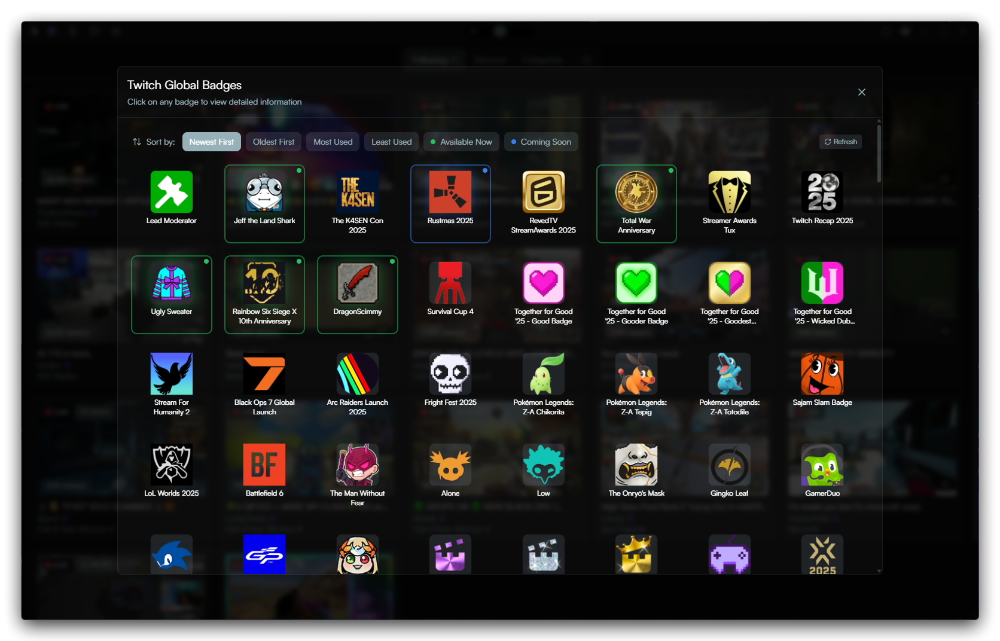
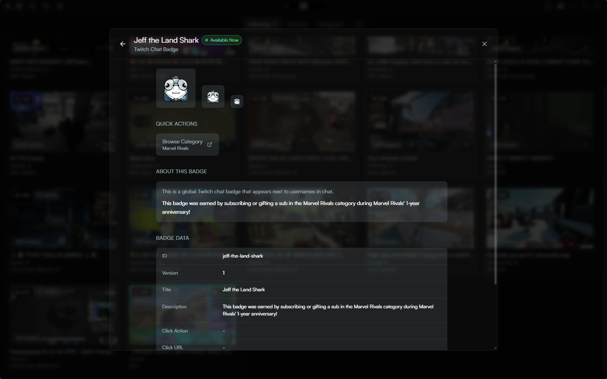
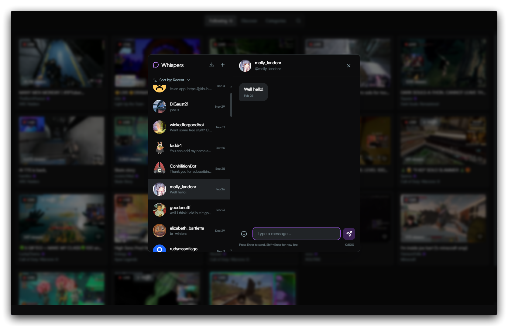
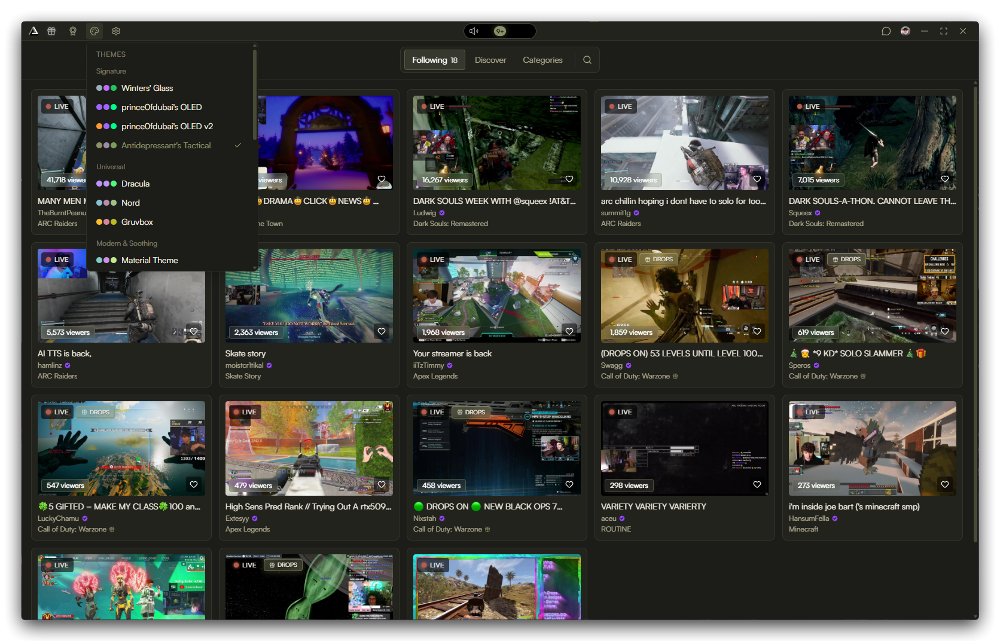

  

  <h1>StreamNook: The Lightweight Twitch Desktop App
</h1>

  

    

      
      
      
    

    

      
      
      
    

    

      
      
    

  

  

---

## 🎯 The Problem

Let's be honest: you're grinding through your 47th hour of that indie roguelike, talking to yourself about optimal build paths, when you realize—*I need human voices*. But opening Twitch in a browser? That's like inviting a resource-hungry elephant to sit on your CPU. Your fans spin up, your frame rate tanks, and suddenly you're choosing between watching streams and actually playing games.

**StreamNook** is the answer to this very specific but deeply relatable problem.

Built from the ground up with Rust and React, StreamNook delivers a buttery-smooth Twitch experience that sips resources instead of chugging them. It's the cozy corner of the internet where you can watch streams, chat with communities, and track your favorite streamers—all without turning your PC into a space heater.

---

## Screenshots

### 🎬 Watching Streams
*Stream viewing with full chat integration and emote support*

### 📺 Sidebar Navigation
*Quick access to all your favorite features*

### 👥 Following List
*See who's live at a glance*

### 🎮 Browse Categories
*Discover new content across Twitch categories*

### 🔔 Dynamic Island
*macOS-inspired notification center for real-time updates*

### 🎁 Drops Farming
*Automated drops collection and campaign tracking*

### 🏅 Badge Collection

  
  

### 💬 Native Whispers
*Full whisper messaging with history support*

### 🎨 Theme Customization
*Multiple beautiful themes to match your style*

---

## Key Features

### 🎬 Native Video Playback
- Built-in player powered by Plyr, HLS.js, and Streamlink
- Adaptive quality selection with custom presets
- Picture-in-picture support for true multitasking
- Low-latency streaming that keeps you in sync with chat
- Theater mode and compact view with configurable window presets
- **Jump to live edge** on stream load
- Auto-switch to another stream when the current one goes offline

### 🛡️ Ad-Free Streaming
- **Integrated TTV LOL PRO** — Playlist proxy routing for ad-free playback, bundled out of the box
- **Proxy Health Checker** — Real-time latency and status dashboard for all available proxy regions
- **Auto Proxy Optimizer** — Automatically selects the fastest proxy on first launch and persists your choice
- Zero-config — the setup wizard handles everything

### 💬 First-Class Chat Experience
- Full Twitch IRC integration with smooth scrolling and performant message rendering
- **7TV, BetterTTV, and FrankerFaceZ** emote support with animated emotes and zero-width overlays
- **Predictions** — Real-time interactive overlay with outcome voting, channel points balance, countdown timer, and win/loss resolution states
- **Hype Train** — Live progress bar with level tracking, contribution stats, and celebration animations
- **Pinned Chat Messages** — GQL-backed pinned message display with automatic 5-second polling
- **Resub & Watch Streak Banners** — In-chat notification banners for resubscriptions and shareable watch streak milestones
- Badge rendering for subs, mods, VIPs, and third-party badges with detailed info overlays
- **7TV cosmetics** — Paint and badge cosmetics rendered natively
- **Apple-style emoji rendering** with native emoji picker
- Bits cheers with animated icons and tier-colored displays
- **Chat timestamps** with optional seconds precision
- **Moderator tools** — Message deletion, timeouts, and bans reflected in real time
- **Mention autocomplete** — @-mention suggestions as you type

### 📺 Home Screen & Discovery
- Browse followed and recommended streams
- Explore Twitch categories and games
- Search for channels
- **Streamer About Panel** — Channel panels and social links in a slide-in view with carousel header toggle
- Picture-in-picture mode while browsing

### 🤖 Automated Farming & Rewards
- **Auto Channel Points Mining** — Collect channel points automatically across all watched channels
- **Auto Drops Farming** — Automated campaign tracking and progress monitoring
- **In-App Drops Login** — Secure browser window for drops authentication
- **Quick Mining Toggle** — Start/stop mining directly from the chat window
- **Channel Points Leaderboard** — Track points across all streamers
- **Twitch Inventory Viewer** — Manage all earned drops and rewards in one place
- **Manual Channel Selection** — Choose specific channels for drops mining
- **Badge Quick Actions** — View linked campaigns directly from badge details

### 🔗 Channel Automation
- **Follow/Unfollow from App** — Manage follows directly from StreamNook
- **Raid Auto-Follow** — Automatically follow raids to keep up with the action
- Secure in-app browser automation — no manual intervention needed

### 🔔 Notifications
- **Desktop Notifications** — Go-live alerts with stream preview thumbnails, customizable sounds, and quick-launch
- **Dynamic Island** — macOS-inspired notification center for real-time drops progress, channel points, live alerts, and update availability
- **Toast System** — In-app toast notifications for predictions, bets, errors, and system events
- **Changelog Overlay** — What's new display on version updates

### 💬 Whisper Messaging
- Full send/receive functionality with dedicated chat windows per conversation
- Complete history retrieval via Twitch GraphQL API
- Real-time notifications via EventSub WebSocket
- **History import tool** — Export and view your entire Twitch whisper history

### 🔌 Integrations
- **Discord Rich Presence** — Show what you're watching with stream details
- **Profile Cards** — Detailed streamer stats with follow age, account info, and social links
- Subscribe overlay for easy sub management
- Badge collection and display system with detailed badge info
- **7TV cosmetics** — Paints, badges, and animated emotes

### 🎨 Theming & Customization
- **15+ built-in themes** — Night Owl, Synthwave '84, Material Theme, Winter's Glass, and more
- **Custom Theme Creator** — Build your own themes with a full color picker and live preview
- Dynamic theme switching from the title bar
- **Compact View Mode** — Configurable window presets for multi-monitor setups

### ⚡ Power User Features
- Universal caching system for blazing-fast load times
- Granular settings for every aspect of the app
- Advanced Streamlink configuration (low-latency, HLS live edge, custom path, proxy)
- Automatic updates with optional auto-install
- First-time setup wizard with guided configuration
- Bundled Streamlink — no external dependencies required

### 🦀 Lightweight Architecture
- Built with **Rust** for maximum performance
- **React** frontend for smooth, responsive UI
- Native desktop integration via **Tauri**
- Minimal memory footprint (~500MB vs. browser's 1.5GB+)
- No Electron bloat in sight

---

## Tech Stack

StreamNook is built on a modern, performance-first stack:

### Frontend
- **React 18** — UI framework
- **TypeScript** — Type safety and developer experience
- **Vite** — Lightning-fast build tooling
- **Tailwind CSS** — Utility-first styling
- **Plyr + HLS.js** — Professional-grade video playback
- **Zustand** — Lightweight state management

### Backend
- **Rust** — Systems programming language for performance
- **Tauri** — Native desktop framework (Electron's cooler cousin)
- **Tokio** — Async runtime for concurrent operations
- **Reqwest** — HTTP client for API calls
- **Serde** — Serialization/deserialization

### Services & APIs
- **Twitch Helix API** — Stream data, user info, and Drops
- **Twitch GQL** — Predictions, channel points, pinned chat, and watch streaks
- **Twitch IRC** — Real-time chat integration
- **Twitch EventSub** — Live notifications, whispers, and hype trains via WebSocket
- **Twitch PubSub** — Channel points and prediction events
- **Streamlink + TTV LOL PRO** — Stream resolution, quality selection, and ad-free proxy (bundled)
- **7TV API** — Extended emotes and cosmetics
- **Discord RPC** — Rich presence integration

---

## Installation

### Quick Start

1. Download the latest release from the [Releases page](https://github.com/winters27/StreamNook/releases/latest)
2. Extract and run the application
3. Follow the setup wizard to sign in with your Twitch account
4. Start watching streams

That's it. StreamNook comes with everything bundled—no external dependencies or configuration required.

---

## Roadmap

### 🔮 Planned
| Feature | Description |
|---------|-------------|
| Multi-stream viewing | Watch multiple streams simultaneously in a tiled layout |
| VOD playback | Watch past broadcasts with synchronized chat replay |
| Clip creation | Create, manage, and share clips directly from the app |

### ✅ Recently Shipped
- **Predictions overlay** — Interactive betting UI with real-time odds, channel points balance, and win/loss states
- **Hype Train integration** — Live progress tracking with level indicators and celebration animations
- **Pinned chat messages** — GQL-backed pinned message display with automatic polling
- **Streamer About panel** — Channel info with panels and social links in a slide-in view
- **Watch Streak sharing** — Share milestone banners directly from the chat interface
- **Resub notification banners** — Visual banners for resubscription events
- **Ad-blocking proxy** — TTV LOL PRO integration with auto-optimized proxy selection
- **Custom Theme Creator** — Full theme editor with color picker and live preview
- **Compact View mode** — Configurable window presets for multi-monitor setups

- **Mention autocomplete** — @-mention suggestions while typing in chat

### 📦 Foundation (Shipped)

Core features that ship with every release

- Native video playback with Plyr, HLS.js, and Streamlink
- Full Twitch chat with 7TV, BTTV, and FFZ emote support
- Animated 7TV emotes with zero-width overlays
- Apple-style emoji rendering across all platforms
- Home screen with stream browsing and discovery
- Sidebar navigation and picture-in-picture mode
- Auto channel points mining and drops farming
- In-app drops login with secure browser window
- Quick mining toggle from chat window
- Channel points leaderboard and inventory management
- Follow/unfollow and raid auto-follow automation
- Desktop notifications with sounds and thumbnails
- Dynamic Island notification center
- Whisper messaging with history and import tool
- Chat timestamps with optional seconds display
- Moderator tools — bans/timeouts reflected in chat
- Discord Rich Presence integration
- 15+ built-in themes with dynamic switching
- Bundled Streamlink distribution
- Auto-update with optional auto-install
- First-time setup wizard
- Auto-switch when stream goes offline
- 7TV cosmetics — paints, badges, and animated emotes
- Universal caching system

---

## Contributing

StreamNook is open source and we welcome contributions! Whether it's bug reports, feature requests, documentation improvements, or code contributions—we'd love to have you involved.

---

## Credits

StreamNook stands on the shoulders of giants:

- **[Streamlink](https://github.com/streamlink/streamlink)** - The backbone of our streaming infrastructure
- **[Tauri](https://tauri.app/)** - Making native desktop apps not suck
- **[Plyr](https://plyr.io/)** - Beautiful video player
- **[HLS.js](https://github.com/video-dev/hls.js)** - HLS streaming support
- **[7TV](https://7tv.app/)** - Extended emote support
- **[Twitch](https://dev.twitch.tv/)** - For having a (mostly) decent API

Special thanks to the open-source community for making projects like this possible.

---

## License

This project is licensed under the MIT License - see the [LICENSE](LICENSE) file for details.

---

  

    
  

  

    
    
    
  

  

    

      StreamNook is not affiliated with Twitch Interactive, Inc.
    

  

<!-- Build: 2026.03.27 -->
