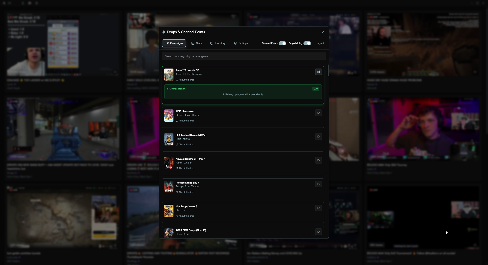

# StreamNook

A native Twitch desktop client.

---

You're grinding through your 47th hour of that indie roguelike, talking to yourself about optimal build paths, when you realize *I need human voices*. But opening Twitch in a browser? That's like inviting a resource-hungry elephant to sit on your CPU. Your fans spin up, your frame rate tanks, and suddenly you're choosing between watching streams and actually playing games.

StreamNook is the answer to this very specific but deeply relatable problem. Built from the ground up with Rust and React, it delivers a smooth Twitch experience that sips resources instead of chugging them. The cozy corner of the internet where you can watch streams, chat with communities, and track your favorite streamers without turning your PC into a space heater.

## What you get

**Ad-free playback up to 1440p.** Built-in ad blocking strips ads at every quality up to 1440p. First-run auto-optimizer picks the fastest proxy region for you, and the built-in latency dashboard lets you switch any time. Picture-in-picture, theater mode, and jump-to-live-edge on every stream load. When the channel you're watching goes offline, StreamNook auto-switches you to another live one without asking.

**Custom theming engine.** 24 built-in themes including Winters' Glass, Dracula, Nord, Gruvbox, Tokyo Night, and Catppuccin, plus a full theme creator with color picker, live preview, and dynamic switching from the title bar. Build your own and tune every color in the UI, save it, swap back any time.

**VODs and offline-channel chat.** Watch past broadcasts the same way you watch live streams. Open chat for any offline channel and participate without waiting for them to go live, no need to load Twitch in a browser just to drop a message in someone's offline chat.

**Whispers.** Integrated send and receive with a dedicated chat window per conversation. Full history comes with you, including an import tool for prior Twitch whisper exports. Incoming whispers ping you live, never on a delay.

## MultiNook

Many streams at once, all their chats alongside. Grid layout for as many streams as you want running simultaneously, each with its own chat panel right next to it.

  

**Dock, undock, drag.** Rearrange the grid however you want. Undock any tile into its own window to push it onto another monitor while the rest of the grid keeps running. Drop it back into the grid when you're done with it.

**Audio focus on click.** Whichever tile you click is the one you hear. Click another tile to switch.

**Per-tile quality control.** A background stream can sit at 480p while your focus tile runs at full quality. Watch a six-stream tournament without melting your bandwidth.

## MultiChat

Standalone chat client. Use StreamNook for chat only, no stream required.

  

**Tabs or splits.** Add 1 to N channels as tabs, or split a window into 2, 3, or 4 columns to read them all at once. Whatever layout fits how you watch chat.

**A window per monitor.** Run as many MultiChat windows as you have displays. Each window is independent, with its own channels and layout.

**Runs in the background.** MultiChat keeps going when the main window is hidden to the system tray, so you can use StreamNook as a pure chat surface and tuck the rest away.

**Pop chat out from anywhere.** Right-click any stream tile or use the chat widget's pop-out button. The popped-out chat keeps running in its own window even after you close the originating stream, so you can keep chatting long after you've moved on.

## Chat

The chat is the part this app gets right. Every piece of the live Twitch chat surface is rendered properly, and every customization you'd want is one click away.

  

**Every emote on Twitch.** Full 7TV, BetterTTV, and FrankerFaceZ support with animation and zero-width overlays. Apple-style emoji rendering across every surface. Native emoji picker built into the chat input.

**Twitch-native events done right.** Subscription and resubscription announcements with shareable banners, watch streak milestone banners, Hype Train overlay with progress and contributors and level-up animations, Predictions overlay with voting outcomes and channel points balance and countdown and win/loss resolution, Pinned messages, Bits cheers with animated icons and tier-colored displays. Everything Twitch surfaces in their own player, surfaced properly here too.

**Built-in copypastas.** Curated library of common copypastas you can fire with a click. Useful for when chat is moving fast and you don't have time to type the obvious thing.

**Custom command creator.** Build your own slash commands and text triggers from a UI inside the app. No config files, no restarts. Define an alias, set the expansion, save it, fire it the next time you type. Triggers can be slash-prefixed or plain text patterns.

  

**Custom user profiles.** Set a nickname, custom color, and personal notes for any user. They're pulled up automatically every time that user chats. Persistent across sessions and synced across all your windows.

**Highlight phrases.** Match any text or username, assign a custom color, and pick an optional sound alert per phrase. The pings that matter actually catch your eye instead of getting lost in the scroll.

**Local-only commands.** `/clearmessages` to wipe a user from your view without involving Twitch. `/usercard <name>` to open a profile card on anyone. Plus the rest of the local chat commands, all client-side, none of them visible to the channel.

**Moderator tools.** Ban, timeout, clear, mod, VIP, all reflected in real time. Dedicated moderator log pane. Slash-command autocomplete and mention autocomplete (`@` as you type). Reply threads. Everything a mod needs without flipping back to the Twitch dashboard.

## Farming

**Drops.** Automated campaign tracking and progress monitoring across every channel you watch. Inventory viewer for everything you've earned. Manual channel selection if you want to target a specific campaign. In-app drops login via a secure embedded browser. No external miner, no other apps to run, no separate window for it to live in.

  

**Channel points.** Auto-mine across every channel you watch. Cross-streamer leaderboard so you can see where your points are concentrated. Quick mining toggle lives right in the chat widget so you can flip it on and off mid-conversation. Raid auto-follow keeps your follow list current when streamers raid out, so the next raid's mining starts the moment they land.

## Badge tracker

For people who chase the collectibles. StreamNook tracks every cosmetic on the platform and lets you manage what you're wearing, when you're wearing it.

**Every Twitch badge, tracked and dated.** Browse the full collection with detail cards, live status (Available / Coming Soon / Expired), and quick actions for jumping straight to a badge's drop campaign. Newly-dropped badges show up the moment they ship.

  
  

**Every 7TV cosmetic, kept current.** Browse every paint and badge in circulation, hover any item for set and author info, see what's new since you last checked.

  
  

**Chatterino and Chatterino Homies badges.** Tracked and rendered next to Twitch and 7TV cosmetics, so you can spot the chat-client devs and their crews in any room.

**Manage everything from one place.** Pick which Twitch badges sit next to your name, equip and swap 7TV paints, choose which 7TV badges you wear. Everything renders live in chat the moment you change it.

**StreamNook ranks.** Every StreamNook user gets a permanent rank number based on signup order. A small StreamNook badge sits in front of your name in any Twitch chat, visible only to other StreamNook viewers. Hover it for a cypher-decode animation that resolves to your tier card and rank number. Some numbers in the registry are special. Whoever lands on them finds out why.

  
  

## Power user

- **Command palette (Ctrl+K).** Jump to any channel, run any command, open any setting, all from one keyboard shortcut.
- **Cross-window settings sync.** Change a setting in any window, every other window picks it up immediately.
- **Optional auto-update.** Set it once and never think about updates again.
- **Compact view presets** for multi-monitor setups, with configurable window sizes per preset.

  

## Lives where you work

- Dynamic Island notification center for drops progress, channel points, live alerts, and updates.
- Native desktop notifications with stream thumbnails, custom sounds, and one-click launch.
- Discord Rich Presence.
- System tray persistence so chat keeps flowing while the main window is hidden.

## Built on

Rust, TypeScript, React, and Tailwind. Packaged as a native desktop app with Tauri.

## Install

1. Grab the latest build from the [Releases page](https://github.com/winters27/StreamNook/releases/latest).
2. Extract and run.
3. Follow the setup wizard to sign in with Twitch.

Everything's built in. Nothing else to install.

## Credits

- [Tauri](https://tauri.app/), native desktop framework.
- [Plyr](https://plyr.io/), video player.
- [HLS.js](https://github.com/video-dev/hls.js), HLS streaming support.
- [7TV](https://7tv.app/), extended emotes and cosmetics.
- [Twitch](https://dev.twitch.tv/), platform and APIs.

## License

MIT. See [LICENSE](LICENSE).

---

  
  
  

  
  
  

  
  

StreamNook is not affiliated with Twitch Interactive, Inc.

